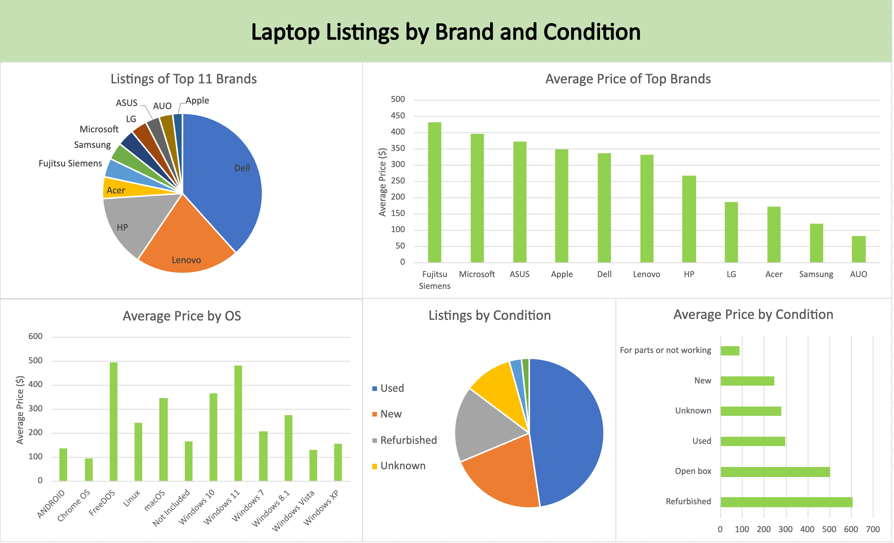
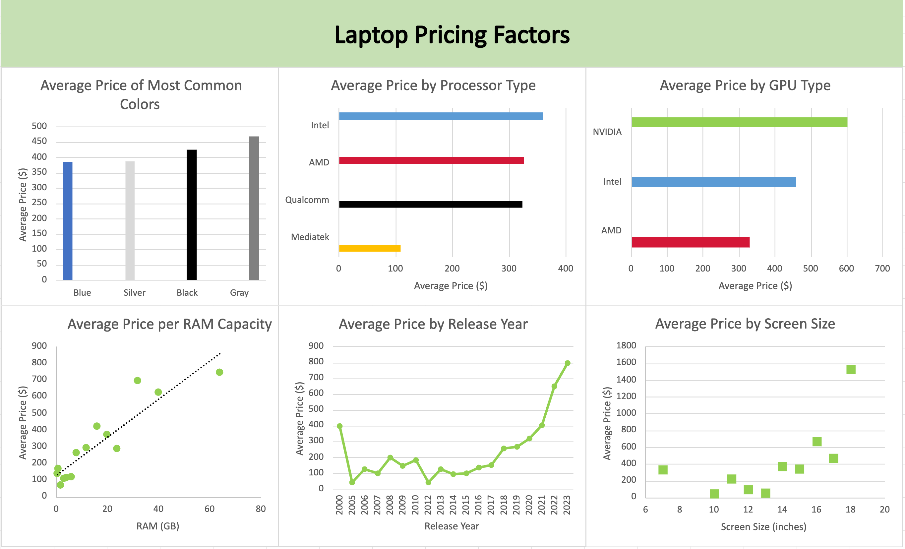

# eBay Laptop Pricing Analysis
**Analysis by [Nathaniel Webster](https://www.linkedin.com/in/nathaniel-webster/)**  
**Published May 2025**  

## Introduction
Customers shopping for computers will often turn to eBay, a popular website where individuals can buy and sell pretty much anything. But how do sellers determine what price to list their computers at, and what factors should buyers be aware of that affect the price they end up paying? This analysis attempts to answer these questions by providing insights on how various computer attributes affect listing prices.

## Methodology
I downloaded Elvin Rustamov’s [eBay Laptops & Netbooks Sales](https://www.kaggle.com/datasets/elvinrustam/ebay-laptops-and-netbooks-sales?select=EbayPcLaptopsAndNetbooksUnclean.csv) from Kaggle. This dataset contains information scraped from 6000 laptop and netbook listings on eBay, including pricing, manufacturer, and specifications. 

Since I was working with the unclean version of the dataset, I had to go through a lengthy cleaning process. To start I removed duplicate rows, which encompassed about a third of the data. Then I went column by column to standardize the attributes. This typically involved some combination of sorting, filtering, IF and IFS formulas, and string substitution. I also had to apply my existing knowledge of laptops and their components to determine if values were reasonable.

In the Brand column, 8 entries were listed under multiple brands, such as “DELL/HP/Lenovo/Toshiba”. This wasn’t useful for analysis, so I used conditional formatting to highlight and remove these rows.

For the screen size, some listings had descriptions of the display beyond the size, so I manually took only the screen size measurement.

For laptop color, I grouped by basic color, so “space gray” and “graphite” were both considered gray. This helped with analysis since there are many unique names for colors given by the manufacturer.

I checked some outliers in terms of RAM size manually, and found that some listings were reporting storage capacities instead of memory. Most of these I had to leave blank, since there wasn’t other available data to determine the RAM.

I grouped the GPU and processor columns by the company that designed them. For some listings, I was able to use formulas to replace the name of the chip with the name of the company that makes it.

After cleaning the data, I used Excel pivot tables and charts to make two dashboards showcasing my findings.

## Results

The most commonly listed laptop brands contain many familiar names, including Dell, Lenovo, and HP. These top brands were around the middle in terms of pricing, whereas Apple, known for being expensive, was only fourth. Fujitsu Siemens, Microsoft, and ASUS were the most expensive among top brands.

Looking at price by Operating System, laptops offering newer versions of Windows and MacOS were expensive, while those with Linux and particularly ChromeOS were much cheaper.

Surprisingly, when considering the condition of the computer, used ones were listed for more on average than new products, and both categories were significantly cheaper than open box and refurbished offerings.

Though gray laptops were the most expensive color on average, there was not much difference with other colors.

Looking at processor type (CPU), Intel, AMD, and Qualcomm computers were all similarly priced, with Mediatek machines much cheaper. Computers with NVIDIA GPUs were the most expensive, with Intel in the middle and AMD being the cheapest.

There are clear trends with increased RAM capacity corresponding to higher prices and newer computers also being priced higher. The correlation was less clear with laptop screen size, but particularly large displays did tend to be more expensive.

## Discussion of Key Findings

Some factors proved more predictive of listing price than others. I expected the brand to be very important, but it turned out that the top brands had mostly similar average prices. This could indicate hardware components are more important to consumers than the brand.

I was also expecting new laptops to be listed for significantly more than used ones, but they were actually slightly cheaper. More research would be needed to explain this counterintuitive result, but one possibility is that particularly nice laptops tend to be used before they are offered for sale on eBay.

Amongst hardware specs, RAM capacity showed a strong correlation with price, which is expected since that’s one of the key features people consider when purchasing a computer. I expected screen size to also be important, but there was not a clear correlation with price except for the largest screen sizes. This could mean other components contribute more to the manufacturing costs of a computer. 

Laptops with NVIDIA GPUs costed more than those with other graphics cards, which makes sense as discrete graphics cards are an additional manufacturing cost. However, I was surprised that laptops with AMD graphics were cheaper than those with Intel graphics. AMD makes discrete graphics cards unlike Intel, but since they also make CPUs perhaps most of the computers captured in this sample were AMD integrated graphics.

Release year was a strong predictor of price. As expected, there is more demand for newer and better hardware. There was some price fluctuation with particularly old laptops, perhaps because rare or vintage computers carry more demand than relatively recent models that are easy to find.

## Conclusion
From the eBay data, it seems that hardware components such as RAM or the GPU influence the price a laptop is listed at more than more superficial factors such as the brand or color. Future analysis could confirm this trend by looking at additional hardware components such as screen type and resolution, specific processor and GPU models, or storage.

## Data Source

* [eBay Laptops & Netbooks Sales](https://www.kaggle.com/datasets/elvinrustam/ebay-laptops-and-netbooks-sales?select=EbayPcLaptopsAndNetbooksUnclean.csv) Posted by Elvin Rustamov to Kaggle